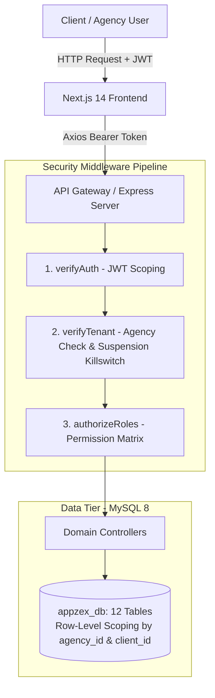

# AppZex — Multi-Tenant Agency Operations & Client Portal

> A production-ready, multi-tenant B2B SaaS platform engineered for digital agencies to run internal project execution and client collaboration from a unified, isolated environment.

---

## 🎯 Executive Overview

Agencies often suffer from operational fragmentation: internal teams manage sprints in one tool, while client communication, change requests, and deliverables are scattered across emails and chat apps. 

**AppZex** solves this with a **shared-database, shared-schema multi-tenant architecture**. It delivers an internal operations workspace for agency administrators and team members, coupled with a dedicated, isolated **Client Portal** for external stakeholders—all guarded by strict row-level isolation and role-based access control.

---

## 🏗️ System Workflow & Architecture

---

## 📈 Engineering Approach: Phase 0 to Phase 7

The system was conceived, engineered, and delivered in 8 disciplined milestones:

### **Phase 0: Domain Modeling & Database Architecture**
* Designed an enterprise-grade 12-table relational schema in MySQL 8.
* Established foreign key cascade rules, strict constraints, and indexes across high-traffic lookups (`agency_id`, `project_id`, `status`).
* Modeled audit logging and isolated file storage schemas.

### **Phase 1: Multi-Tenant Core & Authentication**
* Implemented stateless authentication using JWT and `bcrypt` password hashing.
* Built the core tenant resolver middleware: validates the agency's lifecycle status and automatically injects `req.agencyId` into incoming requests.
* Prevented duplicate agency registrations with unified atomic onboarding.

### **Phase 2: Super Admin Governance & Impersonation Engine**
* Engineered a centralized platform governance console with global metrics (active agencies, total tenants, platform users).
* Added an instant tenant suspension killswitch.
* Created the **Support Mode** impersonation mechanism allowing platform staff to generate diagnostic scoped tokens safely.

### **Phase 3: Agency Workspace & Project Engine**
* Built agency CRM models for managing client companies and onboarding client portal users.
* Developed the **Dynamically Derived Progress Engine**: calculates real-time deliverable velocity based on task completion ratios.

### **Phase 4: Sprint & Task Management Subsystem**
* Implemented task workflows across four distinct states (`todo`, `in_progress`, `review`, `completed`).
* Added priority sorting (`low`, `medium`, `high`, `urgent`), due date tracking, milestone associations, and personal assignee filters (`my_tasks`).

### **Phase 5: Client Collaboration Portal & Change Requests**
* Provisioned an isolated client interface hiding internal agency operational noise.
* Structured an asynchronous **Change Request Workflow** (`open` $\rightarrow$ `in_review` $\rightarrow$ `in_progress` $\rightarrow$ `resolved`/`declined`) with agency reply capabilities.
* Implemented internal vs. client-shared visibility toggles for meeting sync notes.

### **Phase 6: Secure Asset Storage & Activity Audit Stream**
* Configured controlled file uploads via Multer to private disk storage.
* Secured downloads behind tenant-validated streaming endpoints (`/api/v1/files/:id/download`) to prevent unauthorized hotlinking or IDOR access.
* Built a central event audit stream logging platform events.

### **Phase 7: Next.js Minimalist Frontend & Interactive Experience**
* Built the frontend using **Next.js 14 App Router** with pure `.jsx` and Tailwind CSS.
* Created a 4-Role interactive login card switcher with one-click demo autofill pills for instant testing.
* Designed modular cards, badges, progress bars, and modals following the minimalist **Productive.io** design philosophy.

---

## 🛠️ Technology Stack

* **Backend**: Node.js (Pure ES Modules), Express.js, MySQL 8 (`mysql2/promise` pool), JWT, Helmet, CORS, Multer.
* **Frontend**: Next.js 14 (App Router, `.jsx`), Tailwind CSS, Lucide React, Axios.
* **Architecture**: Shared-Database Multi-Tenancy, Row-Level Security (RLS) via Middleware, Stateless Bearer Auth.

---

